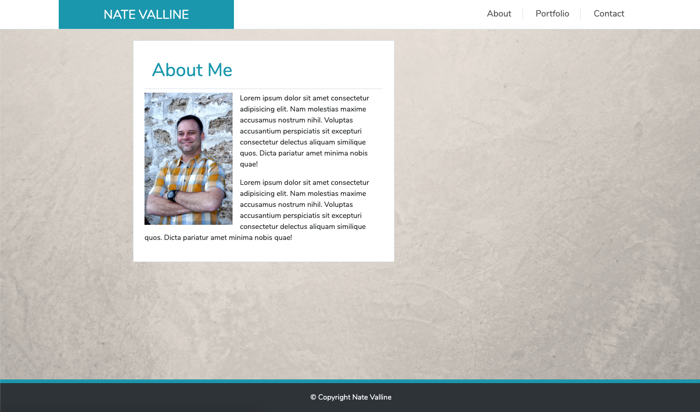

# Nate Valline's Portfolio



> This is a responsive portfolio design

---

### Table of Contents

Your section headers will be used to reference location of destination.

- [Description](#description)
- [How To Use](#how-to-use)
- [References](#references)
- [License](#license)
- [Contributors](#contributors)

---

## Description

For this project I created a simple, responsive portfolio design to showcase; who I am, my projects and a way to contact me. I began by developing the index.html page utilizing the Bootstrap 4 framework. Once created I was able to copy the repeating elements to the portfolio.html and contact.html files. This created continuity between the pages.

This was also designed as a responsive website that will adjust to different device widths is a clean and purposeful manner.

#### Technologies

- HTML 5
- CSS 3
- Bootstrap 4

---

## How To Use

Use the source files as a template to create your own portfolio.

#### Installation

Download or copy the source files.

#### API Reference

```html
<p>dummy code</p>
```

[Back To The Top](#project-name)

---

## References

[Back To The Top](#project-name)

---

## License

Copyright (c) [2020][nate valline]

[Back To The Top](#project-name)

---

## Contributors

- Nate Valline

[Back To The Top](#project-name)
